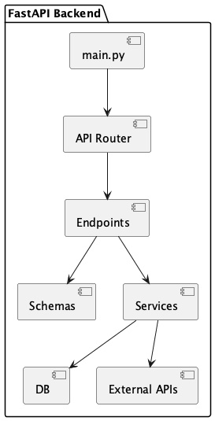

# 🚀 mealScale Backend — FastAPI

Este directorio contiene el **Backend** de mealScale, implementado con **FastAPI**, siguiendo una arquitectura modular y preparada para autenticación, análisis y servicios externos.

---

## 📁 Estructura del Backend

```
Backend/FastAPI-Backend/
├── app/
│   ├── main.py                # Punto de entrada FastAPI
│   ├── api/v1/
│   │   ├── router.py          # Router principal
│   │   ├── endpoints/         # Endpoints REST
│   │   │   ├── analyze.py
│   │   │   ├── auth.py
│   │   │   ├── protected.py
│   │   │   └── users.py
│   │   └── schemas/           # Schemas Pydantic
│   ├── core/                  # Configuración y seguridad
│   ├── db/                    # Modelos y sesión DB
│   └── services/              # Servicios externos y lógica
├── Dockerfile
├── docker-compose.yml
└── requirements.txt
```

---

## 🧠 Responsabilidades del Backend

* Exponer endpoints REST (`/api/v1/...`)
* Autenticación y autorización
* Validación de datos con **Pydantic**
* Procesamiento de análisis de alimentos
* Integración con servicios externos (Google / OpenAI)
* Registro y control de acceso

---

## 🚀 Ejecución local

### Opción 1: Python + venv

```bash
cd Backend/FastAPI-Backend
python -m venv .venv
source .venv/bin/activate  # Linux/Mac
pip install -r requirements.txt
uvicorn app.main:app --reload
```

### Opción 2: Docker

```bash
docker-compose down -v
docker-compose build --no-cache
docker-compose up
```

---

## 📘 Documentación automática

Una vez levantado el backend:

* Swagger UI → `http://localhost:8000/docs`
* ReDoc → `http://localhost:8000/redoc`

---

## 📐 UML – Componentes del Backend



---

## 🧩 DAMA aplicado (nivel básico)

| Elemento         | Aplicación                 |
| ---------------- | -------------------------- |
| Calidad de datos | Schemas Pydantic           |
| Seguridad        | JWT / permisos             |
| Gobernanza       | Configuración centralizada |
| Trazabilidad     | Logs y control de acceso   |

---

## 🛠️ Tecnologías

* Python
* FastAPI
* Pydantic
* SQLAlchemy
* Docker

---

## ✍️ Autor

**MCC Jesús E. Cruz Mtz**
