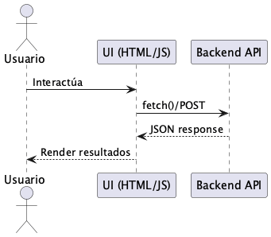

# 🍏 mealScale Frontend — food_scanner

Este directorio contiene el **Frontend web** de mealScale. Está construido con **HTML, CSS y JavaScript puro**, enfocado en simplicidad, control manual del DOM y experimentación con cámara y APIs.

---

## 📁 Estructura del Frontend

```
Frontend/food_scanner/
├── app.html          # Vista principal
├── login.html        # Login de usuario
├── base.html         # Layout base
├── css/style.css     # Estilos
├── js/
│   ├── app.js
│   ├── analyze.js
│   ├── auth.js
│   ├── camera.js
│   ├── front.js
│   ├── theme.js
│   └── ui.js
├── img/
└── google-login-test.html
```

---

## 🧠 ¿Qué hace el Frontend?

* Permite al usuario:

  * Iniciar sesión
  * Capturar datos (y cámara)
  * Enviar información al backend
* Maneja estados de UI:

  * carga
  * error
  * resultado
* Consume la API REST de FastAPI

---

## 🚀 Uso

Este frontend es **estático**, no requiere build.

```bash
cd Frontend/food_scanner
# abrir directamente
open app.html
```
mejor con el servidor web abierto
```bash
python3 -m http.server 3000
```

> Para uso completo, el **Backend debe estar corriendo**.

---

## 🔧 Configuración de API

En los archivos JS se define la URL base del backend, por ejemplo:

```js
const API_BASE_URL = "http://localhost:8000";
```

Ajusta según tu entorno (local, Docker, red local).

---

## 🔁 Flujo Frontend



---

## 🧩 DAMA (lado Front)

| Principio    | Implementación                 |
| ------------ | ------------------------------ |
| Calidad      | Validaciones básicas en UI     |
| Trazabilidad | Consola / logs JS              |
| Separación   | JS modular por responsabilidad |

---

## 🛠️ Tecnologías

* HTML5
* CSS3
* JavaScript (Vanilla)
* Fetch API

---

## ✍️ Autor

**MCC Jesús E. Cruz Mtz**
